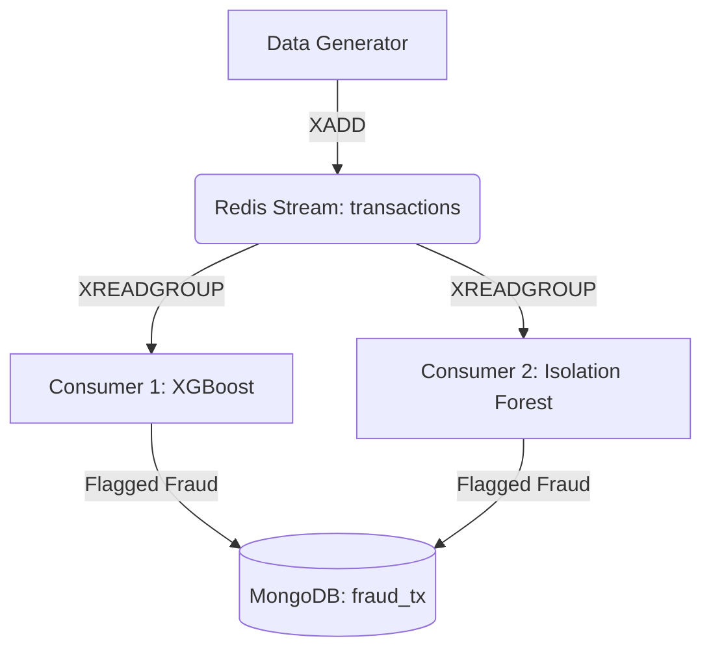

# Serious Projects Repository

A collection of high-impact engineering projects focusing on scalable architectures, machine learning, and real-time data processing.

## 📁 Repository Projects

| Project | Description | Status |
| :--- | :--- | :--- |
| **[Fraud Detection System](./Fraud_Detection_System)** | Real-time transaction simulation and ML-based fraud flagging. | 🟢 Active |

---

# 🛡️ Fraud Detection System (FDS)


A real-time, scalable fraud detection system designed to simulate transaction traffic, process it through machine learning models, and store flagged fraudulent activities for further analysis.

## 🚀 Overview

This project implements a robust pipeline for detecting fraudulent financial transactions in real-time. It leverages a producer-consumer architecture using **Redis Streams** as a high-performance message broker and **MongoDB** for persistent storage of suspicious activities.

### Key Components:
- **Data Generator (Producer):** Simulates realistic transaction data based on user profiles, merchant categories, and geographical locations.
- **Consumer Services:** Distributed workers that ingest transactions from Redis, apply machine learning models (XGBoost & Isolation Forest), and flag fraudulent entries.
- **Machine Learning Models:** Pre-trained models optimized for detecting anomalies and supervised fraud patterns.

## 🏗️ Architecture



## 🛠️ Tech Stack

- **Language:** Python 3.x
- **Message Broker:** [Redis](https://redis.io/) (Streams)
- **Database:** [MongoDB](https://www.mongodb.com/)
- **Machine Learning:**
  - [XGBoost](https://xgboost.readthedocs.io/)
  - [Scikit-learn](https://scikit-learn.org/) (Isolation Forest)
  - [Pandas](https://pandas.pydata.org/)
- **Utility Tools:**
  - [Faker](https://faker.readthedocs.io/) (for realistic data generation)
  - Jupyter Notebooks (for model training and experimentation)

## 📁 Project Structure

```text
Fraud_Detection_System/
├── Consumer/               # Real-time transaction processors
│   ├── consumer1.py        # XGBoost-based fraud detection
│   └── consumer2.py        # Isolation Forest-based anomaly detection
├── generator/              # Data simulation engine
│   └── data_generator.py   # Realistic transaction producer
├── models/                 # Pre-trained ML models (.pkl)
├── data/                   # Log files and generated datasets
├── utils/                  # Model training and data conversion notebooks
├── main.py                 # Orchestration script to run the entire system
└── .env                    # Configuration for environment variables
```

## ⚙️ Setup & Installation

### 1. Prerequisites
- Python 3.8+
- Redis Server (running on `localhost:6379`)
- MongoDB (running on `localhost:27017`)

### 2. Install Dependencies
```bash
pip install -r requirements.txt
```
*(Note: Create a requirements.txt if not present, containing: pandas, redis, pymongo, xgboost, scikit-learn, faker)*

### 3. Environment Configuration
Ensure your `.env` file is configured with the correct connection strings for Redis and MongoDB.

## 🏃 How to Run

To start the entire system (Producer + Consumers):

```bash
python main.py
```

This will:
1. Initialize the Consumers to wait for transaction data.
2. Start the Data Generator to begin streaming transactions into Redis.

Detected fraud transactions will be automatically saved to the `fraud_detection` database in MongoDB.

## 📊 Future Roadmap

- [ ] **Dashboard:** Add a real-time monitoring dashboard using Streamlit or Grafana.
- [ ] **Model Retraining:** Implement automated model retraining pipelines based on new fraud labels.
- [ ] **Scalability:** Containerize the services using Docker and orchestrate with Kubernetes.
- [ ] **Alerting:** Integrate Slack/Email alerts for high-confidence fraud detections.